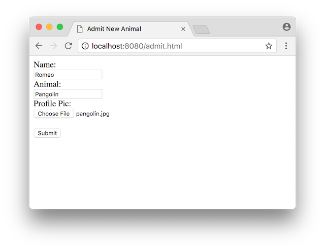

Virtual Zoo
===========

In this tutorial, we'll enable an application for OpenTracing and use the
tracing data to guide us in making several optimizations. The application we're
going to work with is a virtual zoo. Users can admit new animals into the zoo
by filling out a form and submitting a profile picture. 



Our application keeps track of its members with a database and renders a splash
page with thumbnail pictures of all the animals organized into a table.


The application uses NGINX to load-balance between multiple Node.js backends
and serve static content. When processing a new admittance, a Node.js server
writes the profile data to a shared sqlite database and resizes the profile
picture to a common thumbnail size. Here's what the NGINX configuration looks 
like:

```
events {}

http {
  upstream backend {
    server node-server1:3000;
    server node-server2:3000;
    server node-server3:3000;
  }

  server {
    listen 8080;
    server_name localhost;

    # Displays the zoo's splash page.
    location = / {
      # Don't pass the body so that we can handle internal redirects
      # from `/upload/animal`
      proxy_set_body             off;
      proxy_pass http://backend;
    }

    # Display the profile for a specific animal in the zoo.
    location = /animal {
      proxy_pass http://backend;
    }

    # Admit a new animal.
    location = /upload/animal {
      limit_except POST { deny all; }

      proxy_pass http://backend;
      
      # Redirect to the spash page if the animal was successfully admitted.
      proxy_intercept_errors on;
      error_page 301 302 303 =200 /;
    }

    location / {
      root www; 
    }

    location ~ \.jpg$ {
      # Set the root directory for where the Node.js backend uploads image 
      # files.
      include image_params;
    }
  }
}
```

Enabling OpenTracing for NGINX
------------------------------

Enabling OpenTracing for Backends
---------------------------------

Performance Improvements
------------------------
